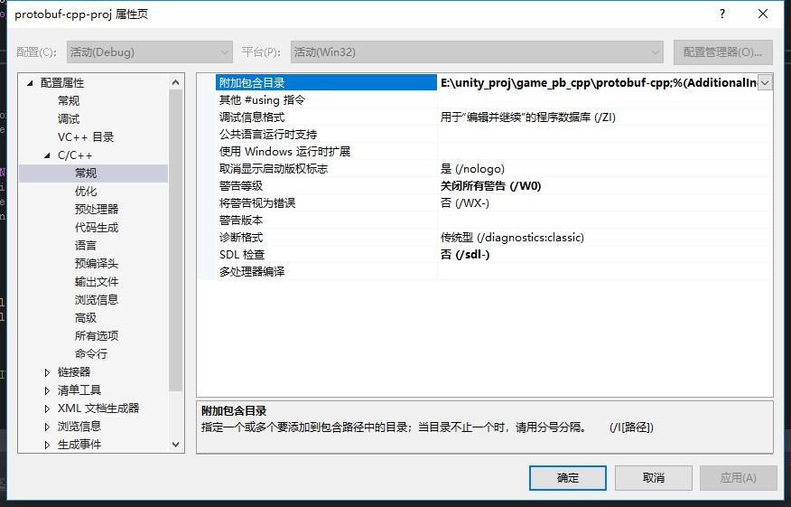
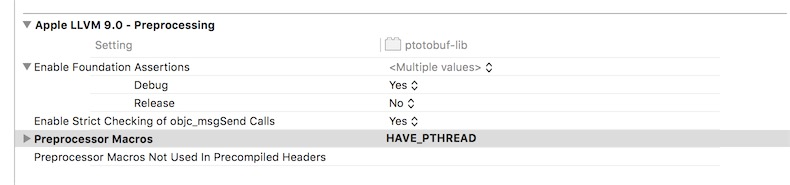
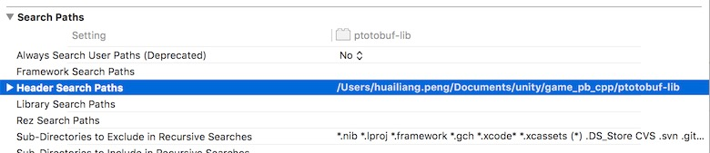
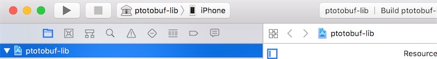

	 <a href="https://huailiang.github.io/">
	    
    	</a>
	
    	<a href="https://huailiang.github.io/">
    	
   	</a>

现在很多采用unity的客户端框架都是用c++来编写，而对数据的处理解析都放在c++端，而不是csharp端。于是在c++端使用protobuf的需求就产生了。

基于这样的需求，我们把google官方的protobuf工程，进行不同平台的编译，以支持不同平台的需求。平台主要是：Android、ios、macos、windows四种平台。

protobuf-cpp项目你需要设置如下：

附加包含目录设置当前protbuf项目下， SDL检查置否

android 编译的时候需要本地有下载好的 NDK，并且把 ndk 路径配置到环境变量中

进入 Android 目录，执行脚本 build_android.sh， 脚本会编译各平台的 so，并且帮助 copy 到 Unity 对应的目录

在编译osx的bundle库的时候，需要设置好宏：

文件搜索路径也需要把protobuf-lib 包含进去：

ios编辑的时候记得选择真机模式，而不是模拟器模式，否则在再真机上不能运行：

你也可以通过lipo命令合并模拟器和真机上的库，参考我之前介绍过的paper, 地址：

https://huailiang.github.io/2018/03/01/exportcpp
